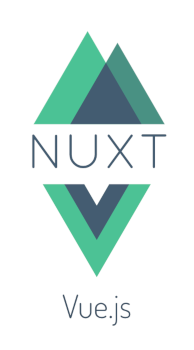
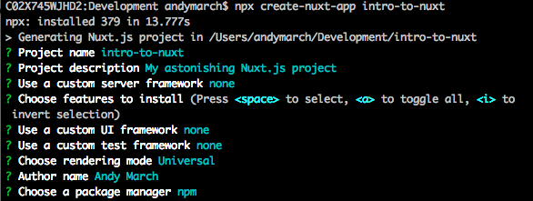
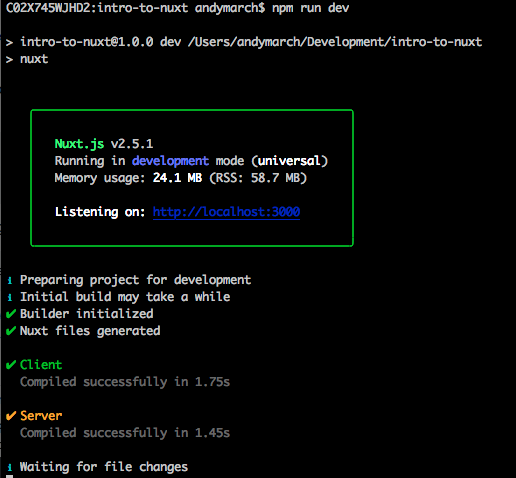
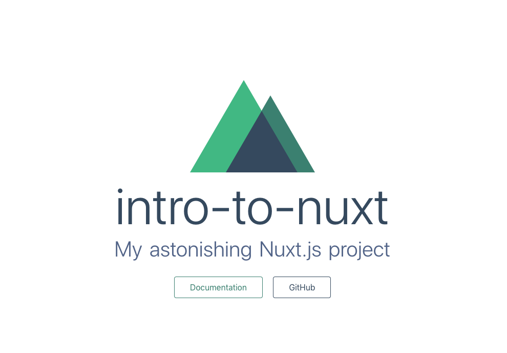
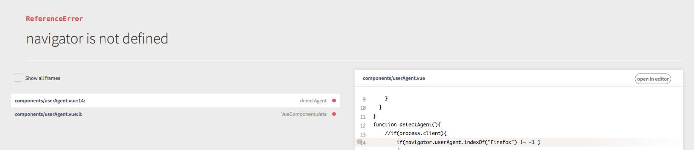
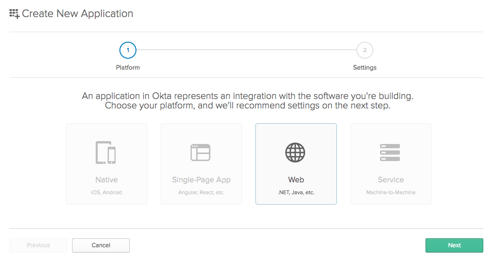
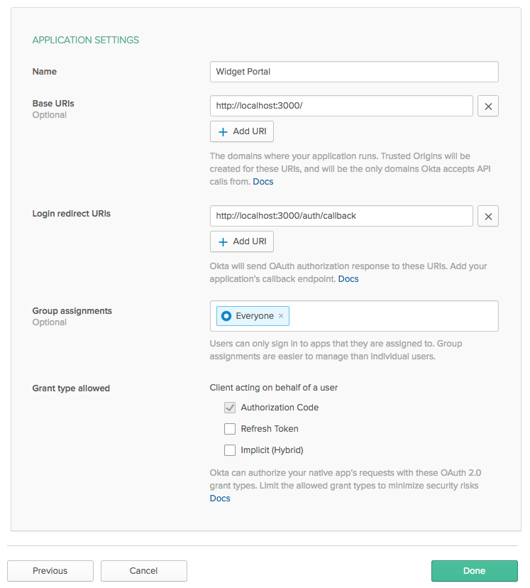
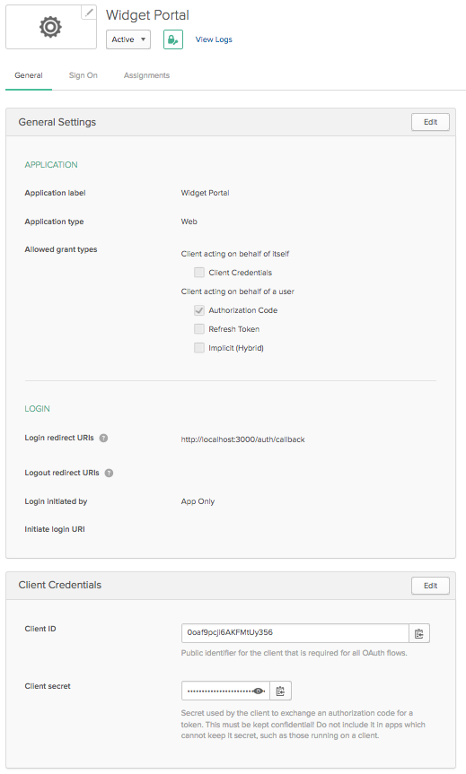
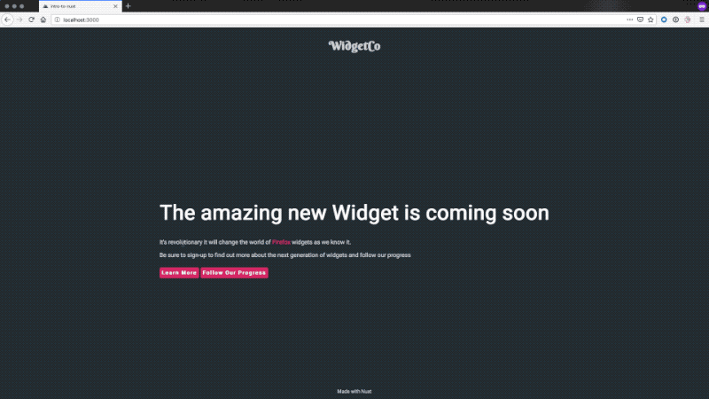

# An Introduction to Universal Applications with Nuxt.js

Reducing the time between a user clicking your application and the content being
displayed is vital. Optimized images? Check! Minified CSS? Check! Minified JS? 
Check! But if your application is a single page application there is a large 
bundle of JavaScript to reach the user before the site can be rendered. Using a
framework like Vue your index page looks like this:

```
<html lang="en">
  <head>
    <meta charset="utf-8">
    <meta http-equiv="X-UA-Compatible" content="IE=edge">
    <meta name="viewport" content="width=device-width,initial-scale=1.0">
    <link rel="icon" href="<%= BASE_URL %>favicon.ico">
    <title>Demo App</title>
  </head>
  <body>
    <noscript>
      <strong>We're sorry but Demo App doesn't work properly without JavaScript enabled. Please enable it to continue.</strong>
    </noscript>
    <div id="app"></div>
    <!-- built files will be auto injected -->
  <script type="text/javascript" src="/app.js"></script>
  </body>
</html>
```

Everything within that page is rendered only once that final app.js is retrieved
from the server. This impacts not just clients on a slow internet connection but
those who can't access JavaScript applications, all they will see is a blank page or
the noscript warning. The vast majority of users will now be running with
JavaScript enabled but this still blocks one major visitor to your site's
content, search engine crawlers. You can work around this with partially
static content pages but this causes furhter problems if you want to place this
content behind the authentication logic that you have already difined in your
router.

The another option is Server Side Rendering (SSR). This technique tries to prepare
as much of your site on the server as possible before sending the rendered page
and its resources to the client. Let's look at the same page prepared with SSR.

```
<html data-n-head-ssr data-n-head="">
  <head data-n-head="">
    <title data-n-head="true">intro-to-nuxt</title>
    <meta data-n-head="true" charset="utf-8">
    <meta data-n-head="true" name="viewport" content="width=device-width, initial-scale=1">
    <meta data-n-head="true" data-hid="description" name="description" content="My astonishing Nuxt.js project">
    <link data-n-head="true" rel="icon" type="image/x-icon" href="/favicon.ico">
    <link data-n-head="true" rel="stylesheet" href="https://fonts.googleapis.com/css?family=Berkshire+Swash|Roboto">
  </head>
  <body data-n-head="">
    <div data-server-rendered="true" id="__nuxt">
        <div id="__layout">
            <div id="defaultLayout">
                <header>
                    <h1 id="branding">WidgetCo</h1>
                </header>
                <div class="content">
                    <div>
                        <h1 class="statement">The amazing new Widget is coming soon</h1>
                        <p class="subtext">It's revolutionary it will change the world of <span class="userAgent"></span> widgets as we know it.</p>
                        <p class="subtext">Be sure to sign-up to find out more about the next generation of widgets and follow our progress</p>
                        <a href="/learnMore" class="callToAction">Learn More</a> <a href="/progress" class="callToAction">Follow Our Progress</a>
                    </div>
                </div>
                <footer id="footer">
                    Made with Nuxt
                </footer>
            </div>
        </div>
    </div>
  </body>
</html>

```

This content is immediately more readable and is easy for bots to index without
the need to seperately configure content for them to find.

While it is entirely possible to roll-your-own SSR implementation with plenty of
frameworks already exist to make this much easier to get started with. For
Angular there is [Angular Universal](https://angular.io/guide/universal), for 
React there is [Next.js](https://nextjs.org/) and for Vue there is 
[Nuxt](https://nuxtjs.org/).

## What is Nuxt?

Nuxt is a framework built on-top of Vue designed to provide opinionated defaults
to address a lot of the issues developers encounter as they develop universal
Vue applications. Nuxt also supports single page and staticly generated
applications but its default is "universal" mode which both a client application
and a node server side.



Nuxt.js bundles Vue 2, Vue Router, Vuex, Vue Server Renderer and
Vue-meta into a 57kB package with webpack, vue-loader and babel-loader to 
support bundling and ES6/7 transilation. Can you do all of this in Vue without 
using Nuxt? Absolutely! There is an [entire guide](https://ssr.vuejs.org) for 
Vue on building SSR application, Nuxt provides only convention over 
configuration with sensible defaults for project structure. If you want to jump
directly to building your application logic without as much wiring then an
opinionated framework like Nuxt is great place to start.


## Zero to one

For this tutorial I'll assume you already have a recent version of NPM installed
so we'll run the following command from the terminal to launch the nuxt template.

>$ npx create-nuxt-app intro-to-nuxt

The nuxt template guides you through the setup of your project metadata. To 
keep it simple I'm going to select the default for all the options



Once that has completed you are left with a simple project structure and can
start the application in a development mode using the following two commands.

>$ cd intro-to-nuxt  
>$ npm run dev



During the build you will notice both a client and a server package is prepared.
Once that completes if we open a browser to http://localhost:3000 we are greeted
by the Nuxt splash screen.



Now we have a running application let's take a tour of what the structure that 
Nuxt creates for you.

**Assets** and **components** are present as you would expect with a vue 
project, except they are now present at the root level rather than being 
within /src.

**Static** contains resources which will be make available exactly as they are 
from the root of the application. This is the same as the public directory you 
would get with a Vue project.

**Layouts:** Vue files in this folder provide the scaffolding for your 
application. These are wrappers around the `<nuxt /`> tag which display the
page.  

**Middleware:** Vue files in this folder are invoked by the router before
rendering a page.  

**Pages:** These are the routes of your Nuxt application. The router generated
by nuxt will create a route for each Vue file in this directory.  

**Plugins:** Vue files in this directory allow you to execture logic before
running the application.  

**Store:** This folder acts as the repository for Vuex (the state management
library for Vue).  

Finally in the root directory you will see a **nuxt.config.js** this allows us
to define the behaviour of our Nuxt application such as setting global includes
and middleware. The key's available here are extensive we'll touch on some
during this tutorial but it's worth browsing the [configuration documentation](https://nuxtjs.org/guide/configuration/) to
see some of the options available to you.


## Building on the sample
<!-- Modify the sample with some data so it does something -->

Let's build the sample out into something a little more realistic. For this
tutorial we'll build a simple promo and release status page for a product.

In your editor of choice open up the directory created by the Nuxt template.

First we'll update the index.vue in the pages directory with some more relevent
content.

```
<template>
  <div>
    <h1 class="statement">The amazing new Widget is coming soon</h1>
    <p class="subtext">It's revolutionary it will change the world of <UserAgent />  widgets as we know it.</p>
    <p class="subtext">Be sure to sign-up to find out more about the next generation of widgets
    and follow our progress</p>
  </div>
</template>

<script>
import UserAgent from '../components/userAgent.vue'
export default {
  components: {
    UserAgent
  }
}
</script>

<style>
</style>
```

This page is now referencing a standard Vue component in our component directory
so create the file userAgent.vue in that directory with the following content.

```
<template>
    <span class="userAgent">{{userbrowser}}</span>
</template>
<script>
export default {
  data() {
    return {
      userbrowser: detectAgent()
    }
  }
}
function detectAgent(){
    if(process.client){
        if(navigator.userAgent.indexOf("Firefox") != -1 ) 
        {
            return 'Firefox'
        }
        else if(navigator.userAgent.indexOf("Chrome") != -1 )
        {
            return 'Chrome'
        }
        else if(navigator.userAgent.indexOf("Safari") != -1)
        {
            return 'Safari'
        }
        else 
        {
            return 'browser'
        }
    }
}
</script>
<style>
</style>
```

One of the difficulties of handling components originally built for SPAs in a 
universal application is how to detect and behave when the user's browser isn't 
present. Nuxt provides a simple way to handling this from the context which is 
available globally. In userAgent.vue we're using the process.client conditional
to ensure that navigator is never referenced during the server side render. If
we remove that condition we would get an error during build like this:




Now we have a landing page let's build out some more content.
Add the following to inside the div tags of index.vue.

```
    <nuxt-link to="/learnMore" class="callToAction">Learn More</nuxt-link>
    <nuxt-link to="/progress" class="callToAction" no-prefetch>Follow Our Progress</nuxt-link>
```

The nuxt-link behaves in much the same as router-link in Vue and
is used to create links between the pages of your application. One of the
benefits of using nuxt-link is that when a nuxt-link is displayed the linked
page is prefetched to improve responsiveness. You can disable this behaviour by
adding ```no-pretech``` property to the link.

Lets add two more pages to populate those links. Create the files learnMore.vue
and progress.vue in the pages folder. The nuxt router will automatically create
routes for these pages based on the file names.

First the learnMore.vue:
```
<template>
  <div>
    <h1 class="statement">Learn more about our widgets</h1>
    <p class="bodytext">We grow the finest widgets with our secret receipe.</p>
    <p class="bodytext">
        Lorem ipsum dolor sit amet, consectetur adipiscing elit. Maecenas in 
        urna sed mauris consequat semper. Vestibulum faucibus id velit facilisis
        pharetra. Vivamus tincidunt orci eget metus pretium tristique. Nullam mi
        massa, interdum et sagittis in, pellentesque id metus. Praesent in 
        mattis purus, vitae auctor nisi. Maecenas ut orci nec urna vestibulum
        laoreet. Phasellus lacinia iaculis imperdiet. Nullam tincidunt velit
        eu tortor varius scelerisque. Nullam placerat ligula tincidunt mi
        placerat blandit.
        Interdum et malesuada fames ac ante ipsum primis in faucibus. Maecenas sodales
        finibus diam, a aliquet sapien. Nam molestie eros non tincidunt facilisis.
        Praesent facilisis massa a lorem commodo, a ultricies arcu vehicula. Curabitur a
        tincidunt magna. Maecenas porta sodales turpis id tempus. Etiam fringilla
        tincidunt ullamcorper. Phasellus quis dolor dignissim, tincidunt dolor et,
        viverra neque. Praesent at tellus turpis. Integer nec aliquet est, ut ultricies
        ex. Sed purus ex, pretium ut facilisis quis, accumsan eu elit. Nullam ac egestas
        metus, non viverra libero. Integer a turpis diam. Duis ullamcorper eleifend est
        id ullamcorper.
    </p>
    <nuxt-link to="/" class="callToAction">Go back</nuxt-link>
  </div>
</template>

<script>
    export default {
        head () {
            return {
                title: `About our widgets`,
                meta: [
                    { hid: 'description', name: 'description', content: 'WidgetCo provides the finest in modern widgets, find out how...' },
                    { name: 'keywords', content: 'widgetCo, widgets, widget design'},
                ]
            }
        }
    }
</script>

<style>
</style>
```

For the learn more page we have extended the default head values to ensure that
we have a good page description and keywords embedded in the meta. Any values
set here will override any global head values you set in the nuxt.config.js.
This is all handled by [vue-meta](https://github.com/nuxt/vue-meta).

Then the progress.vue
```
<template>
  <div>
    <h1 class="statement">Progress Report</h1>
    <p>{{statusDate.toLocaleDateString("en-US")}}</p>
    <p class="bodytext">
      {{statusUpdate}}
    </p>
    <nuxt-link to="/" class="callToAction">Go back</nuxt-link>
  </div>
</template>

<script>
export default {
  data() {
    return {
      statusUpdate: 'We are sorry to report that bad weather has impacted the growth of our widgets. We are working as fast as we can to get widgets dispatched to you.',
      statusDate: new Date()
    }
  }
}
</script>

<style>
</style>
```
In this page we are using the script tag to dynamically inject values for the
data and status message. These can be referenced in the template using the
```{{variable}}``` syntax

Better, but what about the elements which will be common between pages? This is
where layouts comes in. Each of the pages we've just created sit within a layout
so you can reuse strutural features without needing to write them into each
page. As we have not defined a layout explicitly the default layout created by
the template is being used. Open the default.vue from the layouts folder.
Layouts are wrappers around the ```<nuxt />``` tag which renders the page so we
can write html as we normally would.

```
<template>
  <div id=defaultLayout>
    <header><h1 id="branding">WidgetCo</h1></header>
    <div class="content">
      <nuxt />
    </div>
    <footer id="footer">
      Made with Nuxt
    </footer>
  </div>
</template>

<style>
  body #__nuxt, #__layout,#defaultLayout {
    display: flex;
    min-height: 98vh;
    flex-direction: column;
  }
  .content {
    flex: 1;
  }
</style>
```

Now we have common elements which can be displayed around our pages. You can use
different layouts to handle a change in presentation between different parts of
your site from marketing to documentation for example.

Currently our application is looking very bland so lets add some CSS. Inside the
assets directory create a new folder called css and add a main.css file with the
following content.

```
html{
    background: #20313b;
}

body{
    font-family: 'Roboto', sans-serif;
    color: hsl(240, 5%, 83%);
}

.content{
    margin-top: 50px;
    display: flex;
    flex-direction: column;
    flex-wrap: wrap;
    justify-content: center;
    align-items: center;
    font-weight: lighter;
}

footer{
    font-size: smaller;
    display: flex;
    flex-direction: column;
    flex-wrap: wrap;
    justify-content: center;
    align-items: center;
    font-weight: lighter;
}

header{
    display: flex;
    flex-direction: column;
    flex-wrap: wrap;
    justify-content: center;
    align-items: center;
    font-weight: lighter;
}

#branding{
    font-family: 'Berkshire Swash', cursive;
}

.statement{
    color: white;
    font-size: 350%
}

.callToAction {
    background-color: #e22866;
    color: white;
    border-radius: 4px;
    font-size: 14px;
    font-weight: 600;
    letter-spacing: 2px;
    line-height: 45px;
    height: 45px;
    border: 6px solid transparent;
    cursor: pointer;
    text-decoration: none;
}

.userAgent{
    color: #e22866
}

.page-enter-active, .page-leave-active{
    transition: opacity .5s
}

.page-enter, .page-leave-active{
    opacity: 0
}
```

We can add this stylesheet to the head of all of our pages easily by adding it
to the nxt.config.js. Open this file from the root directory of your project,
within that file there are a number of sections defined update the global CSS as
follows:
``` 
 /*
  ** Global CSS
  */
  css: [
    '@/assets/css/main.css'
  ],
```

That style sheet also included a couple of font from google which we need to
link from our head. You'll find this declared near the top of the file, we'll
add to the link section with the link to the stylesheet.

```
  /*
  ** Headers of the page
  */
  head: {
    title: pkg.name,
    meta: [
      { charset: 'utf-8' },
      { name: 'viewport', content: 'width=device-width, initial-scale=1' },
      { hid: 'description', name: 'description', content: pkg.description }
    ],
    link: [
      { rel: 'icon', type: 'image/x-icon', href: '/favicon.ico' },
      { rel: 'stylesheet', href: 'https://fonts.googleapis.com/css?family=Berkshire+Swash|Roboto' }
    ]
  }
```

While the console shows a refresh when nuxt.config.js is saved because this is
read before the service is run you'll need to stop the running process and
restart with ```npm run dev```. Once you've done so you'll have a styled page
like the below.


## Protecting resources
<!-- Implementing Okta/Social for Identity -->
We don't want to share the information on the progress page with just anyone who
visits the site, we want to restrict that information to just people who have
registered. We want to use modern webauth standards so we'll use OpenID Connect
to grant tokens which we'll use to grant access to our resources.

First go to [developer.okta.com/signup](https://developer.okta.com/signup/)
which will guide you through getting a free developer tenant on the Okta
platform. Once you have signed in as an administrator select Applications from
the menu at the top of the page, then press "Add application".

As we are working as a universal application we'll select Web here. This
determines if a client secret is generated for the application. Single page
applications do not have secure storage for this secret so one is not generated
if you select "Single-Page App".



On the next screen we need to provide a few details about the application we are
creating. The key values are Base URIs and Login Redirect URIs. The former tells
Okta where to expect authentication attempts from and the later tells Okta where
it is allowed to send users to after authentication. For our development
environment we'll add ```http://localhost:3000``` as the base URI and
```http://localhost:3000/auth/callback``` as the login redirect URI. After doing
this we can press done.



This next page shows you the configuration of your application. We'll need the
two values shown at the very bottom of this page Client ID and Client secret.



We'll put them in a .env file in the root of our project.

```
SECRET_KEY="sufficiently long random string to encrypt cookies"
OAUTH_ISSUER="https://your-tenant.okta.com/oauth2/v1/"
CLIENT_ID="your client id"
CLIENT_SECRET="your client secret"
```

Remember this file contains your application's access to the oauth provider and
should not be checked into source control. To enable Nuxt to read this file we 
need to install a package from npm

```
npm i @nuxtjs/dotenv
```

Once that is installed add the following line to the top of
nuxt.config.js

```
require('dotenv').config()
```

Now we need to enable our Nuxt application to use our identity provider as a
source of users. To do this we'll use another npm package to make our 
application OAuth aware.

In your terminal stop the running application and use the following command to
install the library:

```
npm i nuxt-oauth
```

> Reference note: there is a [Nuxt Community Auth module](https://auth.nuxtjs.org/) which supports OAuth
> however currently it is not compliant with the standard as it does not include
> a nonce on requests for tokens. 

Once that is installed we need to configure its behaviour in the nuxt.config.js;
first by adding another line to our modules definition.

```
  modules: [
    ['nuxt-oauth']
  ],
```

Then adding a section to configure the oauth library.

```
  oauth: {
    sessionName: 'WidgetCoSession',
    secretKey: process.env.SECRET_KEY,
    oauthHost: process.env.OAUTH_ISSUER,
    oauthClientID: process.env.CLIENT_ID,
    oauthClientSecret: process.env.CLIENT_SECRET,
    scopes: ['openid', 'profile'],
  },
```

This implementation requires a Vuex store, one is not created by default but
Nuxt brings in the required Vuex dependenciesso we can create one simply by
adding an empty index.vue to the store directory.

Now we have OAuth configured we need to set which routes should require
authentication. We can do this by adding the value ```authenticated: true``` to
the default export of a page. Let's update the script tag of progress.vue:

```
<script>
export default {
  authenticated: true,
  data() {
    return {
      statusUpdate: 'We are sorry to report that bad weather has impacted the growth of our widgets. We are working as fast as we can to get widgets dispatched to you.',
      statusDate: new Date()
    }
  }
}
</script>
```

We've now built a simple universal javascript application with multiple SEO 
friendly pages and a restricted area only available to authenticated users.

