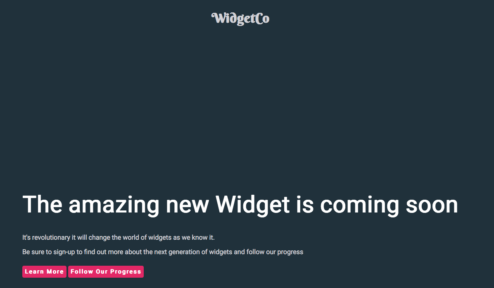

# Tutorial: Build Universal Applications with Nuxt.js

Reducing the time between a user clicking your application and the content being displayed is vital. Optimized images? Check! Minified CSS? Check! Minified JS? Check! But if your application is a single page app (or SPA) there is a large bundle of JavaScript that must reach the user before the site can be rendered.

Universal applications address this problem by executing as much as possible on your server and sending only the finished page to the client. Nuxt.js is a framework built on top of Vue designed to provide opinionated defaults to address a lot of the issues developers encounter as they develop universal applications.

In this tutorial, you’ll build an application with Nuxt using multiple routes populated with data from an API all rendered on the server. Then you will protect that information with authentication and require users to sign in. All you need to follow along all is a version of NPM newer than 5.2.0 and your preferred editor.

With a Vue single page app, your index page looks like this:

Reducing the time between a user clicking your application and the content being displayed is vital. Optimized images? Check! Minified CSS? Check! Minified JS? Check! But if your application is a single page app (or SPA) there is a large bundle of JavaScript that must reach the user before the site can be rendered.

Universal applications address this problem by executing as much as possible on your server and sending only the finished page to the client. Nuxt.js is a framework built on top of Vue designed to provide opinionated defaults to address a lot of the issues developers encounter as they develop universal applications.

In this tutorial, you’ll build an application with Nuxt using multiple routes populated with data from an API all rendered on the server. Then you will protect that information with authentication and require users to sign in. All you need to follow along all is a version of NPM newer than 5.2.0 and your preferred editor.

With a Vue single page app, your index page looks like this:

## Zero to one

To get started, execute the following command from the terminal to launch the Nuxt template.

```bash
npx create-nuxt-app intro-to-nuxt
```

The Nuxt template guides you through the setup of your project metadata. To keep it simple you should select the default for each option.


Once the template has been completed, you are left with a simple project structure and can start the application in a development mode using the following two commands.

```bash
cd intro-to-nuxt  
npm run dev
```


During the build, you will notice both a client and a server package are prepared. Once the build completes if you open a browser to http://localhost:3000 you are greeted by the Nuxt splash screen.


Now that you have a running application, you can take a tour of the structure that Nuxt created for you.

* **Assets** and **components**: These are present as you would expect with a Vue project, except they are now present at the root level rather than being within `/src`.
* **Static**: Contains resources which will be made available exactly as they are from the root of the application. This is the same as the public directory you would get with a Vue project.
* **Layouts:** Vue files in this folder provide the scaffolding for your application. These are wrappers around the `<nuxt /`> tag which displays the page.  
* **Middleware:** Vue files in this folder are invoked by the router before rendering a page.  

**Pages:** These are the routes of your Nuxt application. The router generated by Nuxt will create a route for each Vue file in this directory.  

**Plugins:** Vue files in this directory allow you to execute logic before running the application.  

**Store:** This folder acts as the repository for Vuex (the state management library for Vue).  

Finally, in the root directory, you will see`nuxt.config.js`. This allows us to define the behavior of our Nuxt application, such as setting global includes and middleware. The keys available here are extensive, we'll touch on some during this tutorial but it's worth browsing the [configuration documentation](https://nuxtjs.org/guide/configuration/) to see all of the options available to you.

## Build Your Nuxt Application

Let's build the sample out into something a little more realistic. For this tutorial, you'll build a simple promo and release status page for a product.

In your editor of choice open up the directory created by the Nuxt template.

Update `index.vue` in the pages directory with some relevant content:

```
<template>
  <div>
    <h1 class="statement">The amazing new Widget is coming soon</h1>
    <p class="subtext">It's revolutionary it will change the world of <UserAgent />  widgets as we know it.</p>
    <p class="subtext">Be sure to sign-up to find out more about the next generation of widgets
    and follow our progress</p>
  </div>
</template>

<script>
import UserAgent from '../components/userAgent.vue'
export default {
  components: {
    UserAgent
  }
}
</script>

<style>
</style>
```

This page is now referencing a standard Vue component in our component directory, so you must create the file `userAgent.vue` in that directory with the following content:

```
<template>
    <span class="userAgent">{{userbrowser}}</span>
</template>
<script>
export default {
  data() {
    return {
      userbrowser: detectAgent()
    }
  }
}
function detectAgent(){
    if(process.client){
        if(navigator.userAgent.indexOf("Firefox") !== -1 ) 
        {
            return 'Firefox'
        }
        else if(navigator.userAgent.indexOf("Chrome") !== -1 )
        {
            return 'Chrome'
        }
        else if(navigator.userAgent.indexOf("Safari") !== -1)
        {
            return 'Safari'
        }
        else 
        {
            return 'browser'
        }
    }
}
</script>
<style>
</style>
```

One of the difficulties of handling components originally built for SPAs in a universal application is managing how to detect and behave when the user's browser isn't present. Nuxt exposes `process.client`, `process.server` and `process.static` globally to determine the context the renderer is running in. In `userAgent.vue` you’re using the `process.client` conditional to ensure that the navigator is never referenced during the server side render. If you were to remove this conditional logic, you would get an error during build like this:


Now that you have a landing page you can build out some additional content. Add the following inside the div tags of `index.vue`.

```
    <nuxt-link to="/learnMore" class="callToAction">Learn More</nuxt-link>
    <nuxt-link to="/progress" class="callToAction" no-prefetch>Follow Our Progress</nuxt-link>
```

The `nuxt-link` behaves in much the same as `router-link` in Vue and is used to create links between the pages of your application. One of the benefits of using `nuxt-link` is that when a `nuxt-link` is displayed the linked page is pre-fetched to improve responsiveness. You can disable this behavior by adding the `no-pretech` property to the link.

Add two more pages to populate those links. Create the files `learnMore.vue` and `progress.vue` in the pages folder. The Nuxt router will automatically create routes for these pages based on the file names.

First the `learnMore.vue`:

```
<template>
  <div>
    <h1 class="statement">Learn more about our widgets</h1>
    <p class="bodytext">We grow the finest widgets with our secret recipe.</p>
    <p class="bodytext">
        Lorem ipsum dolor sit amet, consectetur adipiscing elit. Maecenas in 
        urna sed mauris consequat semper. Vestibulum faucibus id velit facilisis
        pharetra. Vivamus tincidunt orci eget metus pretium tristique. Nullam mi
        massa, interdum et sagittis in, pellentesque id metus. Praesent in 
        mattis purus, vitae auctor nisi. Maecenas ut orci nec urna vestibulum
        laoreet. Phasellus lacinia iaculis imperdiet. Nullam tincidunt velit
        eu tortor varius scelerisque. Nullam placerat ligula tincidunt mi
        placerat blandit.
        Interdum et malesuada fames ac ante ipsum primis in faucibus. Maecenas sodales
        finibus diam, a aliquet sapien. Nam molestie eros non tincidunt facilisis.
        Praesent facilisis massa a lorem commodo, a ultricies arcu vehicula. Curabitur a
        tincidunt magna. Maecenas porta sodales turpis id tempus. Etiam fringilla
        tincidunt ullamcorper. Phasellus quis dolor dignissim, tincidunt dolor et,
        viverra neque. Praesent at tellus turpis. Integer nec aliquet est, ut ultricies
        ex. Sed purus ex, pretium ut facilisis quis, accumsan eu elit. Nullam ac egestas
        metus, non viverra libero. Integer a turpis diam. Duis ullamcorper eleifend est
        id ullamcorper.
    </p>
    <nuxt-link to="/" class="callToAction">Go back</nuxt-link>
  </div>
</template>

<script>
    export default {
        head () {
            return {
                title: `About our widgets`,
                meta: [
                    { hid: 'description', name: 'description', content: 'WidgetCo provides the finest in modern widgets, find out how...' },
                    { name: 'keywords', content: 'widgetCo, widgets, widget design'},
                ]
            }
        }
    }
</script>

<style>
</style>
```

For the learn more page you have extended the default head values to ensure that you have a good page description and keywords embedded in the meta. Any values set here will override any global head values you set in the `nuxt.config.js`. This is all handled by `[vue-meta](https://github.com/nuxt/vue-meta)`.

Next, you’ll create a page with some dynamic content by talking to an API. For this tutorial, we'll mock an API with a static JSON file. Create `status.json` in the static folder and give it the following content:

```
{
    "statusDate": "2018-04-14",
    "statusUpdate": "We are sorry to report that bad weather has impacted the growth of our widgets. We are working as fast as we can to get widgets dispatched to you."      
}
```

To make your API calls you'll be using the promise-driven Axios library. From the terminal install this package with the following command:

```
npm install axios
```

You are now ready to create your page. Create `progress.vue` in the pages directory and populate it with the following content:

```
<template>
  <div>
    <h1 class="statement">Progress Report</h1>
    <p>{{statusDate}}</p>
    <p class="bodytext">
      {{statusUpdate}}
    </p>
    <nuxt-link to="/" class="callToAction">Go back</nuxt-link>
  </div>
</template>

<script>
const axios = require('axios'); 
export default {
  asyncData ({ params }) {
    return axios.get('http://localhost:3000/status.json')
    .then((res) => {
      return {
        statusUpdate: res.data.statusUpdate,
        statusDate: res.data.statusDate
      }
    })
  }
}
</script>

<style>
</style>

```

On this page, you are using the `asyncData` component to make the Axios call. On the server side, the result is then parsed and made available to the template using the `{{ variable }}` syntax. The difference between `asyncData` and the data syntax is where the call is executed. With data, the call is always made from the client side after the page reaches the client a further call is made to replace values that came with the page. With `asyncData`, the request is made by the server and the result is then merged with the values already in data.

Better, but what about the structure which will be common between pages? 

This is where layouts come in. Each of the pages you've just created sit within a layout so you can reuse features without needing to write them into each page. As you have not defined a layout explicitly, the default layout created by the template is being used. Open the `default.vue` from the layouts folder. Layouts must include the `<nuxt />` tag which renders the page, however, the rest of the structure is up to you, include any HTML or Vue components you need. Replace the `default.vue` content with the following:

```
<template>
  <div id=defaultLayout>
    <header><h1 id="branding">WidgetCo</h1></header>
    <div class="content">
      <nuxt />
    </div>
    <footer id="footer">
      Made with Nuxt
    </footer>
  </div>
</template>

<style>
  body #__nuxt, #__layout,#defaultLayout {
    display: flex;
    min-height: 98vh;
    flex-direction: column;
  }
  .content {
    flex: 1;
  }
</style>
```

Now you have common elements which can be displayed around your pages. You can use different layouts to handle a change in presentation between different parts of your site from marketing to documentation to tutorials.

Currently, your application is looking pretty bland so let's add some CSS. Inside the assets directory create a new folder called `css` and add a `main.css` file with the following content:

```
html{
    background: #20313b;
}

body{
    font-family: 'Roboto', sans-serif;
    color: hsl(240, 5%, 83%);
}

.content{
    margin-top: 50px;
    display: flex;
    flex-direction: column;
    flex-wrap: wrap;
    justify-content: center;
    align-items: center;
    font-weight: lighter;
}

footer{
    font-size: smaller;
    display: flex;
    flex-direction: column;
    flex-wrap: wrap;
    justify-content: center;
    align-items: center;
    font-weight: lighter;
}

header{
    display: flex;
    flex-direction: column;
    flex-wrap: wrap;
    justify-content: center;
    align-items: center;
    font-weight: lighter;
}

#branding{
    font-family: 'Berkshire Swash', cursive;
}

.statement{
    color: white;
    font-size: 350%
}

.callToAction {
    background-color: #e22866;
    color: white;
    border-radius: 4px;
    font-size: 14px;
    font-weight: 600;
    letter-spacing: 2px;
    line-height: 45px;
    height: 45px;
    border: 6px solid transparent;
    cursor: pointer;
    text-decoration: none;
}

.userAgent{
    color: #e22866
}

.page-enter-active, .page-leave-active{
    transition: opacity .5s
}

.page-enter, .page-leave-active{
    opacity: 0
}
```

You can add this stylesheet to the head of all of your pages easily by adding it to the `nuxt.config.js`. Open this file from the root directory of your project, this file is organized into a number of arrays. The template project has included the common ones for you, each is described by a short comment update the global CSS to include your new file:

``` 
 /*
  ** Global CSS
  */
  css: [
    '@/assets/css/main.css'
  ],
```

That stylesheet also includes a couple of fonts from Google which you need to link from your `head`. You'll find this declared near the top of the file. You'll add to the link section with the link to the stylesheet.

```
  /*
  ** Headers of the page
  */
  head: {
    title: pkg.name,
    meta: [
      { charset: 'utf-8' },
      { name: 'viewport', content: 'width=device-width, initial-scale=1' },
      { hid: 'description', name: 'description', content: pkg.description }
    ],
    link: [
      { rel: 'icon', type: 'image/x-icon', href: '/favicon.ico' },
      { rel: 'stylesheet', href: 'https://fonts.googleapis.com/css?family=Berkshire+Swash|Roboto' }
    ]
  }
```

Your console may show a refresh when `nuxt.config.js` is saved. However, since `nuxt.config.js`  is executed before the service is run, you'll need to stop the running process and restart with `npm run dev`. Once you've done so, you'll have a styled page like the one below.



## Protect Your Resources in Nuxt
Perhaps you don't want to share the information on the progress page with just anyone who visits the site. Instead, you want to restrict that information to people who have registered. You also want to use modern web authentication standards like OAuth and OpenID Connect, which you’ll use to retrieve tokens and thus grant access to your resources.

You could build everything yourself, we only need email address and password after all. But how should you store that password? How does someone get back into their account if they forget their password? What happens when you need to enable multi-factor authentication? How can you allow users of this site to access other sites from your company?

Okta to the rescue! Okta provides a secure, simple and standards-based identity source for your application. No more writing registration forms!

First go to [developer.okta.com/signup](https://developer.okta.com/signup/) which will guide you through getting a free developer tenant on Okta. Your tenant will have a name such as dev-1234.okta.com make a note of this address we’ll need it later.

Once you have signed in as an administrator select `Applications` from the menu at the top of the page, then `Add application`.

As you are working as a universal application you'll select `Web` here. This determines if a client secret is generated for the application. Single page applications do not have secure storage for this secret so one is not generated if you select "Single-Page App".


On the next screen, you need to provide a few details about the application you are creating. The key values are Base URIs and Login Redirect URIs. The former tells Okta where to expect authentication attempts from, and the later tells Okta where it is allowed to send users to after authentication. For your development environment, add `http://localhost:3000` as the base URI and `http://localhost:3000/auth/callback` as the login redirect URI. Click done!


This next page shows you the configuration of your application. You'll need the two values shown at the very bottom of this page, Client ID and Client Secret.


You'll put them in an `.env` file in the root of your project, your OAUTH_ISSUER will contain your tenant name followed by `/oauth2/v1`

```
SECRET_KEY="sufficiently long random string to encrypt cookies"
OAUTH_ISSUER="https://{yourOktaDomain}/oauth2/v1/"
CLIENT_ID="{yourClientId}"
CLIENT_SECRET="{yourClientSecret}t"
```

Remember this file contains your application's access to your OAuth provider and should not be checked into source control. To enable Nuxt to read this file you need to install a package from npm.

```
npm i @nuxtjs/dotenv
```

Once that is installed add the following line to the top of `nuxt.config.js`:

```
require('dotenv').config()
```

You also need to enable your Nuxt application to use your identity provider as a source of users. To do this you'll use another npm package to make the application OAuth aware.

In your terminal, stop the running application and use the following command to install the library:

```
npm i nuxt-oauth
```

> Note: there is an official [Nuxt Community Auth module](https://auth.nuxtjs.org/) which supports OAuth. However, as of this writing, it does not include a nonce on requests for tokens. Therefore, it is not standards compliant.

Once that is installed, you need to configure its behavior in the `nuxt.config.js`. First, add `nuxt-oauth`  to the array of modules.

```
  modules: [
    ['nuxt-oauth']
  ],
```

Then add a new `oauth` section to configure the OAuth library.

```
  oauth: {
    sessionName: 'WidgetCoSession',
    secretKey: process.env.SECRET_KEY,
    oauthHost: process.env.OAUTH_ISSUER,
    oauthClientID: process.env.CLIENT_ID,
    oauthClientSecret: process.env.CLIENT_SECRET,
    scopes: ['openid', 'profile'],
  },
```

This implementation requires a Vuex store. Nuxt will not create the store by default, you must create an empty `index.vue` file in the `store` folder. Once Nuxt detects this file it will include the correct dependencies for you.

Now that you have OAuth configured, you need to configure which routes require authentication. You can do this by adding the value `authenticated: true` to the default export of a page. Update the script tag of `progress.vue` in the `pages` folder with the following code.

```
<script>
const axios = require('axios'); 
export default {
  authenticated: true,
  asyncData ({ params }) {
    return axios.get('http://localhost:3000/status.json')
    .then((res) => {
      return {
        statusUpdate: res.data.statusUpdate,
        statusDate: res.data.statusDate
      }
    })
  }
}
</script>
```

Launch a private session in your browser and revisit localhost:3000. Now when you navigate to the progress screen you’ll be required to login.


Congratulations! You've now built a universal JavaScript application! Content is prepared on the server and sent to the user as multiple SEO-friendly pages complete with route specific metadata. You have used `asyncData` to populate your pages with dynamic content from an API. Finally you have protected sensitive information behind an identity provider and can force users to login before granting access.

## Learn More About Vue and Authentication

If you liked this post, you may be interested in some of the other great content here on the Okta Developer Blog!

* [What the Heck is OAuth?](/blog/2017/06/21/what-the-heck-is-oauth)
* [Add Authentication to Your Vanilla JavaScript App in 20 Minutes
](/blog/2018/06/05/authentication-vanilla-js)
* [How to Configure Better Web Site Security with Cloudflare and Netlify
](/blog/2019/04/11/site-security-cloudflare-netlify)
* [Build a Single-Page App with Go and Vue](/blog/2018/10/23/build-a-single-page-app-with-go-and-vue)

As always, feel free to comment below and don't forget to follow us on [Twitter](https://twitter.com/oktadev) and watch us on [YouTube](https://www.youtube.com/channel/UC5AMiWqFVFxF1q9Ya1FuZ_Q)!
